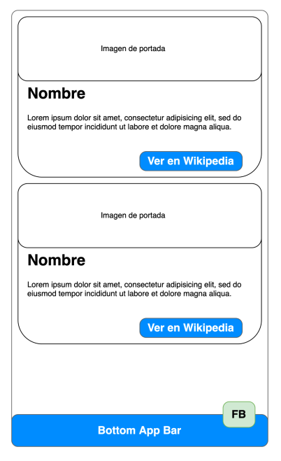
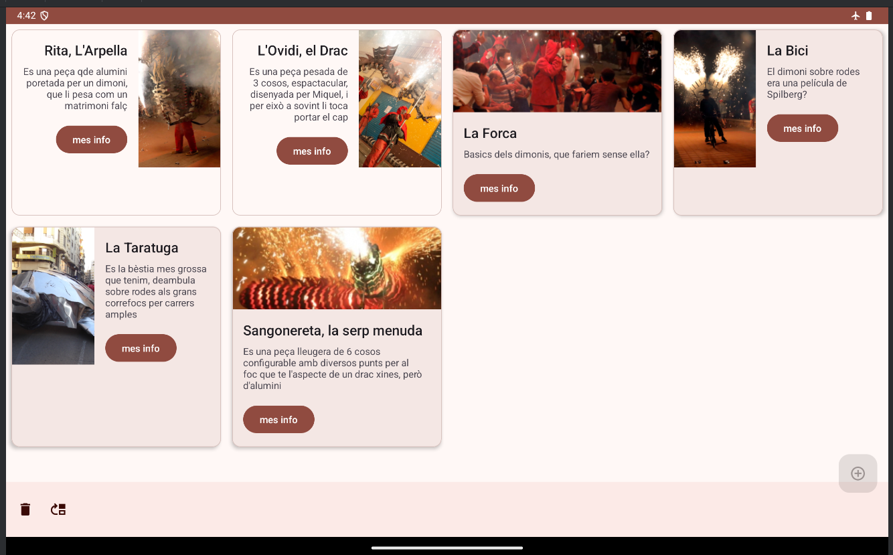
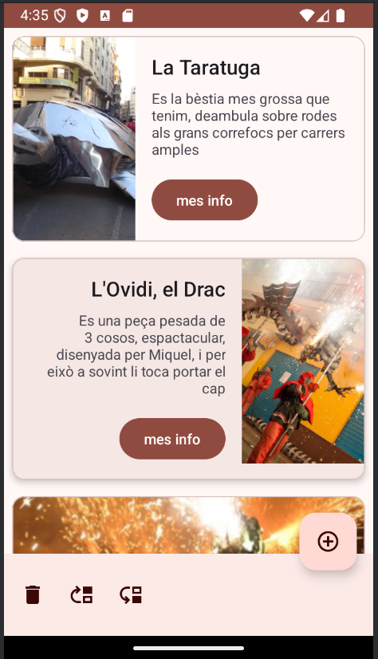

# cards

Mobile DAM app practice

Requirements:
Programación de dispositivos móviles
Práctica 1
Vamos a crear una aplicación usando los componentes de Material Desing
Components.
Para llevarla a cabo empezaremos una nueva aplicación basada en una Scrolling
Activity.
Modificaremos la vista principal: activity_scrolling.xml para que contenga una
BottomAppBar y con un botón para simular “Añadir una nueva card” con un icono.
En ella vamos a crear 4 CardViews que mostrarán información a cerca de 4
personas (periodistas, futbolistas, científicos, streamers, etc…) a nuestra elección.
La información de la aplicación estará contenida en
Las CardViews deben estar contenidas dentro de un único LinearLayout y cada
CardView debe contener un Constraint Layout para poder alinear los elementos.
Cada CardView debe contener los siguientes elementos:
● Imagen de portada (usando Glide)
● Título con el nombre de la persona elegida
● Un breve resumen de información sobre la persona
● Un botón que nos permita enlazar con la información referente a esta
persona en la Wikipedia. El botón contendrá un icono con la imagen de un
enlace.
Requisitos:
● Todos los textos deben crearse a través de recursos string
● Todas las dimensiones deben crearse a través de recursos dimen
● Todas los colores deben crearse a través de recursos colors.
https://m3.material.io/theme-builder#/custom
● Eliminar todos los layouts que no sean necesarios ni vayáis a implementar.
● Para la entrega: enlace directo del repositorio público de github donde
habéis subido la aplicación.

Prototipo:


**Rúbrica de corrección \- Práctica 1**

| ITEM / PUNT.  | 0  | 2  | 8  | 10 |
| ----- | ----- | :---- | :---- | :---- |
| CardViews  | Se han   implementado  CardViews | Cada CardView  tiene su propio  layaout | Las CardViews  incluyen   elementos   diferenciadores  entre ellas | Cada CardView presenta un   diseño   personalizado |
| Constraints  | No se trabajan  las restricciones  de posición   para cada   elemento | Los elementos  presentan   restricciones de  posicionamient o, pero carecen  de restricciones  necesarias |  | Los elementos  están   correctamente  posicionados. |
| Elementos   visuales | Se han usado  elementos   visuales por   defecto. |  | Los elementos  de texto  | Se usan   elementos   visuales MDC  com TIL,   MaterialCardVie w, etc. |
| BottomAppBar  | No se oculta al  hacer scroll | El FAB, no está  posicionado   correctamente. | El FAB está   ubicado   correctamente. | BAB se oculta  con scroll y está  bien ubicado   FAB  |
| Values   parametrizados | No existen   valores   parametrizados | Algunos valores  están   parametrizados  y otros no |  | Todos los   valores están  parametrizados |
| Acceso a   internet y   apertura de   enlaces | Los botones no  abren los   enlaces en el  navegador |  | Los enlaces   abren   correctamente  en el navegador |  |
| Botones con   iconos | Los botones   carecen de   iconos   personalizados | Algunos   botones tienen  iconos y otros  no |  | Cada botón   contiene un   icono   personalizado |
| Código limpio  | Existe mucho  código repetido  en la carga de  imágenes y   apertura de   enlaces. | Existe una   función para la  carga de   imágenes, pero  no para la   apertura de   enlaces. |  | Existe una   función   parametrizada  para la carga   de imágenes y  otra para la   apertura de   enlaces. |
| Imágenes   cargadas a   través de Glide | No usa Glide   para la carga   de imágenes | La carga de   imágenes se   hace a través  de Glide | Las imágenes  cargan a través  de Glide y se   ajustan al   tamaño del   ImageView |  |
| Diseño   personalizado | No se han   personalizado  los colores |  | Combina   colores por  defecto con   personalizados | Uso de paleta  de colores  personalizada  completamente |

# IMPROVINGS

That was quite my first contact with android programming, but for doing this "app" in a usable way ive learned about 
## Android lifecycle
To navigate transitions between stages of the activity lifecycle, the Activity class provides a core set of six callbacks: onCreate(), onStart(), onResume(), onPause(), onStop(), and onDestroy(). The system invokes each of these callbacks as the activity enters a new state.
## Data persistence
### Assets
I tried to work my app with the content of cards stored on json files, i have discovered that this folder is only for initial app data, for persistence of data in the device, you must save files in applicationContext.filesDir
```kotlin
    private fun copyAssetToFile(fileName: String) {
        val assetManager = applicationContext.assets
        val file = File(applicationContext.filesDir, fileName)

        assetManager.open(fileName).use { inputStream ->
            file.outputStream().use { outputStream ->
                inputStream.copyTo(outputStream)
            }
        }
    }
```

### InstanceState
I have collided with reality by knocking down my device, data is lost when something happens. Classes must be "Parcelables" (like serializable) to store in a intermediate InstanceState.

## Behavior
### Landscape
Requirements ignore the layout in landscape mode, but my app calculates the columns of the grid based on the width of the available horizontal space
### Bottom app bar functions
I've implemented buttons and actions for cards in the BottomAppBar
### Scroll Behavior
Cards ar made selectable and focus scrolls to the selected one




